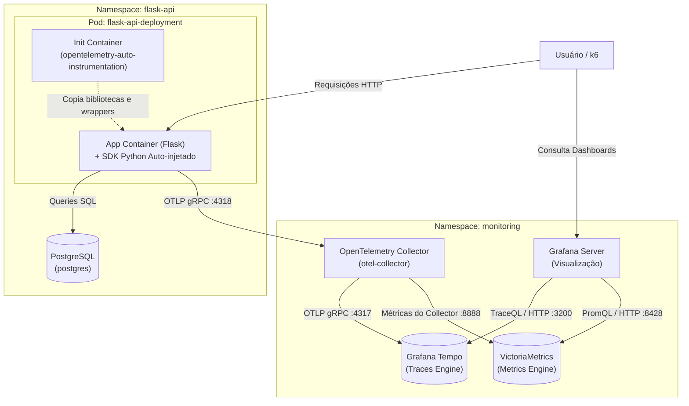
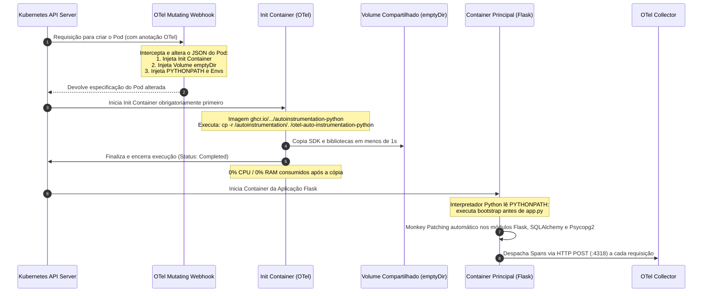

# 🔭 Guia Completo de Observabilidade & Tracing Distribuído
### OpenTelemetry, Grafana Tempo, VictoriaMetrics e Kubernetes

Este documento detalha toda a arquitetura de observabilidade e tracing distribuído implementada no ecossistema do **Mercadinho**, explicando como o OpenTelemetry funciona por baixo dos panos (incluindo o mecanismo de *Init Containers*), a anatomia de *Traces* e *Spans*, a linguagem de consulta *TraceQL* e a operação dos dashboards no Grafana.

---

## 📑 Sumário Executivo
1. [Arquitetura Geral de Observabilidade](#1-arquitetura-geral-de-observabilidade)
2. [Como o OpenTelemetry Funciona & O Papel do Init Container](#2-como-o-opentelemetry-funciona--o-papel-do-init-container)
3. [Pipeline do OpenTelemetry Collector (Receivers, Processors, Exporters)](#3-pipeline-do-opentelemetry-collector)
4. [A Diferença entre Spans Recebidos e Exportados](#4-a-diferen%C3%A7a-entre-spans-recebidos-e-exportados)
5. [Conceitos Fundamentais: Traces vs. Spans](#5-conceitos-fundamentais-traces-vs-spans)
6. [O Caso do Frontend (Nginx) & O Teste de Carga com k6](#6-o-caso-do-frontend-nginx--o-teste-de-carga-com-k6)
7. [TraceQL: A Linguagem de Consulta do Tempo](#7-traceql-a-linguagem-de-consulta-do-tempo)
8. [Estrutura do Dashboard no Grafana](#8-estrutura-do-dashboard-no-grafana)

---

## 1. Arquitetura Geral de Observabilidade

O fluxo de telemetria do cluster é estruturado em três camadas: **Coleta (Auto-instrumentação)**, **Processamento/Roteamento (Collector)** e **Armazenamento/Visualização (Tempo, VictoriaMetrics e Grafana)**:



---

### 2. Como o OpenTelemetry Funciona & O Papel do Init Container

A principal vantagem da arquitetura moderna do OpenTelemetry no Kubernetes é a **Zero-Code Auto-Instrumentation** (instrumentação automática sem necessidade de alterar o código-fonte da aplicação).

---

### O Problema do Jeito Antigo (Sem Auto-Instrumentação)
Tradicionalmente, para habilitar rastreamento distribuído em uma aplicação Python:
1. O desenvolvedor precisava abrir o `requirements.txt` e adicionar dependências como `opentelemetry-api`, `opentelemetry-sdk`, `opentelemetry-instrumentation-flask`, `opentelemetry-instrumentation-sqlalchemy`, `opentelemetry-instrumentation-psycopg2`.
2. Era necessário alterar o código-fonte (`app.py`), inicializar provedores de trace e envolver rotas e banco manualmente com wrappers.
3. Isso causava acoplamento severo: se a biblioteca de observabilidade mudasse de versão, dezenas de microsserviços precisavam ser recompilados e testados.

**A solução moderna:** *Como injetar o SDK completo do OpenTelemetry e interceptar chamadas HTTP e SQL sem alterar uma única linha de código ou o Dockerfile?*  
A resposta está na combinação de **Mutating Admission Webhook + Init Container + Volume Compartilhado + PYTHONPATH**.

---

### Os 4 Passos do Ciclo de Vida da Auto-Instrumentação



---

### Detalhamento Técnico de Cada Etapa

#### Passo 1: A Interceptação pelo Mutating Admission Webhook
No manifesto do deployment da API ([`flask_deploy.yaml`](file:///home/hq/mercadinho-full/mercadinho-infra/manifests/flask-api/flask_deploy.yaml)), apenas uma anotação é inserida:
```yaml
metadata:
  annotations:
    instrumentation.opentelemetry.io/inject-python: "flask-api/flask-api-instrumentation"
```
* O **OpenTelemetry Operator** monitora a API do Kubernetes através de um **Mutating Admission Webhook**.
* Quando o Kubernetes recebe o comando para criar o Pod, o Webhook intercepta o manifesto antes de ser salvo no `etcd`.
* Ele consulta o recurso customizado `Instrumentation` ([`instrumentation.yaml`](file:///home/hq/mercadinho-full/mercadinho-infra/manifests/flask-api/instrumentation.yaml)) e injeta dinamicamente na especificação do Pod:
  1. Um volume efêmero em memória (`emptyDir`) montado em `/otel-auto-instrumentation-python`.
  2. Um `initContainer` oficial do OpenTelemetry.
  3. Variáveis de ambiente que configuram o interpretador Python e os endpoints de telemetria.

---

#### Passo 2: O Papel do Init Container (O "Entregador de Pacotes")
Um `initContainer` no Kubernetes tem garantia de execução: ele roda **antes** do container da aplicação e o container principal fica bloqueado até o término bem-sucedido dele.

* **O que há na imagem do Init Container?**  
  A imagem `ghcr.io/open-telemetry/opentelemetry-operator/autoinstrumentation-python:latest` funciona como um pacote autocontido com todas as bibliotecas Python do OpenTelemetry pré-compiladas.
* **Comando executado:**
  ```bash
  cp -r /autoinstrumentation/. /otel-auto-instrumentation-python
  ```
  Ele descarrega todos os pacotes para dentro do volume compartilhado `emptyDir`.
* **Consumo de recursos:**  
  Assim que a cópia é finalizada (leva menos de 1 segundo), o processo do Init Container termina com código 0 (`Completed`). Ele **não permanece em execução** e não consome CPU ou memória RAM durante a vida útil do pod.

---

#### Passo 3: O "Sequestro Elegante" no Python (Monkey Patching via `PYTHONPATH`)
Quando o container da aplicação (`flask-api`) inicia, ele executa o comando normal configurado no Dockerfile (ex: `gunicorn -w 2 -b 0.0.0.0:8888 app:app`).

Como o Python sabe que deve carregar o OpenTelemetry sem que haja nenhum `import opentelemetry` no código do usuário?

Graças às variáveis de ambiente injetadas pelo Webhook:
```bash
PYTHONPATH=/otel-auto-instrumentation-python/opentelemetry/instrumentation/auto_instrumentation:/otel-auto-instrumentation-python
OTEL_EXPORTER_OTLP_ENDPOINT=http://otel-collector-collector.monitoring.svc:4318
OTEL_SERVICE_NAME=flask-api-deployment
```

1. **Prioridade do `PYTHONPATH`:** O interpretador Python sempre verifica os diretórios listados no `PYTHONPATH` antes de procurar pacotes nas pastas padrão do sistema operacional.
2. **Gancho de Bootstrap (`sitecustomize.py`):** O OpenTelemetry inclui um módulo de bootstrap nesse diretório. O Python nativamente executa esse script antes de carregar o script principal do usuário (`app.py`).
3. **Monkey Patching (Envelopamento Dinâmico):**
   * Esse script intercepta o momento em que bibliotecas conhecidas são importadas pela aplicação.
   * **No Flask:** Envelopa o roteamento HTTP, iniciando automaticamente um Span raiz (`SPAN_KIND_SERVER`) contendo método, rota e código HTTP.
   * **No SQLAlchemy e Psycopg2:** Envelopa os métodos de conexão e execução de queries (`execute()`), criando Spans filhos (`SPAN_KIND_CLIENT`) com a query SQL executada (`SELECT ...`).
4. **Envio Assíncrono:** Os Spans gerados são agrupados em lotes e enviados via HTTP/Protobuf em segundo plano para o `otel-collector` na porta 4318, sem bloquear a resposta ao usuário final.

---

### Evidência Real: Configuração Injetada no Pod do Cluster

Abaixo está o trecho real extraído do pod `flask-api-deployment` em execução no cluster:

```yaml
spec:
  initContainers:
  - name: opentelemetry-auto-instrumentation-python
    image: ghcr.io/open-telemetry/opentelemetry-operator/autoinstrumentation-python:latest
    command: ["cp", "-r", "/autoinstrumentation/.", "/otel-auto-instrumentation-python"]
    volumeMounts:
    - mountPath: /otel-auto-instrumentation-python
      name: opentelemetry-auto-instrumentation-python

  containers:
  - name: flask-api
    image: harbor.henrique.local/mercadinho/backend:latest
    env:
    - name: PYTHONPATH
      value: /otel-auto-instrumentation-python/opentelemetry/instrumentation/auto_instrumentation:/otel-auto-instrumentation-python
    - name: OTEL_EXPORTER_OTLP_ENDPOINT
      value: http://otel-collector-collector.monitoring.svc:4318
    - name: OTEL_EXPORTER_OTLP_PROTOCOL
      value: http/protobuf
    - name: OTEL_SERVICE_NAME
      value: flask-api-deployment
    - name: OTEL_PROPAGATORS
      value: tracecontext,baggage
    volumeMounts:
    - mountPath: /otel-auto-instrumentation-python
      name: opentelemetry-auto-instrumentation-python

  volumes:
  - emptyDir: {}
    name: opentelemetry-auto-instrumentation-python
```

---

### Vantagens Arquiteturais
* **Desacoplamento Total:** O código da aplicação não possui dependências de observabilidade nem lógica de tracing.
* **Manutenção Centralizada:** Atualizações de versão do OpenTelemetry ou parâmetros de amostragem são feitos apenas alterando o manifesto do Kubernetes (`instrumentation.yaml`).
* **Segurança e Imagens Enxutas:** As imagens Docker de produção permanecem menores e livres de bibliotecas de instrumentação desnecessárias no momento do build.

---

## 3. Pipeline do OpenTelemetry Collector

O **OpenTelemetry Collector** funciona como um proxy inteligente de telemetria. Ele recebe os dados de múltiplas fontes, padroniza, agrupa e despacha para os bancos de dados finais.

O pipeline possui 3 blocos bem definidos:

```
[ Receivers ] ➔ [ Processors ] ➔ [ Exporters ]
```

1. **Receivers (Portas de Entrada):**
   * Configurado com protocolo **OTLP** escutando em gRPC (`0.0.0.0:4317`) e HTTP (`0.0.0.0:4318`).
2. **Processors (Tratamento e Otimização):**
   * **`memory_limiter`**: Monitora o uso de memória do pod do Collector. Se o cluster sofrer pico, ele descarta dados antes que o pod sofra *OOMKilled* (Out Of Memory).
   * **`batch`**: Acumula spans em lotes (ex: 100 spans ou a cada 10 segundos). Em vez de disparar centenas de requisições de rede individuais, ele envia pacotes consolidados, reduzindo overhead de CPU e rede.
3. **Exporters (Portas de Saída):**
   * **`otlp/tempo`**: Envia os traces agrupados para o Grafana Tempo (`tempo.monitoring.svc:4317`).
   * **`debug`**: Imprime os metadados dos spans no log padrão (`stdout`) do pod para auditoria.

---

## 4. A Diferença entre Spans Recebidos e Exportados

No dashboard do Grafana, monitoramos duas métricas essenciais do Collector:
* **Total de Spans Recebidos:** `otelcol_receiver_accepted_spans`
* **Total de Spans Exportados ao Tempo:** `otelcol_exporter_sent_spans`

### O "Mistério" do Número Duplicado (Troubleshooting Real)
Durante os testes de carga, o painel exibia:
* *Spans Recebidos:* `905`
* *Spans Exportados:* `1810` (Exatamente o dobro!)

**O motivo:**  
O pipeline de traces estava configurado para exportar para **dois destinos**:
```yaml
service:
  pipelines:
    traces:
      receivers: [otlp]
      processors: [memory_limiter, batch]
      exporters: [otlp/tempo, debug]  # <-- 2 destinos!
```
A métrica `otelcol_exporter_sent_spans` contabiliza o envio de cada destino. Sem filtrar o exportador, o Grafana somava:
$$\text{Spans Tempo (905)} + \text{Spans Debug (905)} = \mathbf{1810}$$

**A correção:**  
Ao filtrar explicitamente `exporter="otlp/tempo"`:
```promql
sum(otelcol_exporter_sent_spans{cluster=~"$cluster", exporter="otlp/tempo"})
```
Os números ficaram rigorosamente **100% alinhados (905 vs 905)**, comprovando que **nenhum span foi perdido ou descartado**.

---

## 5. Conceitos Fundamentais: Traces vs. Spans

### O que é um Trace?
O **Trace** representa a jornada inteira de uma transação ou requisição de ponta a ponta. É a história completa do ponto de vista do usuário.

### O que é um Span?
O **Span** é a menor unidade de trabalho medida. Uma única requisição HTTP (Trace) é composta por múltiplos Spans internos executados em cascata.

### Exemplo Prático Real (Capturado durante o teste do k6):
Ao executar a rota `POST /api/login/auth`, foi gerado **1 Trace** contendo **6 Spans**:

```
[Trace: bd367ab9a362dcd21d4818a4997529b] (Duração Total: 196ms)
 │
 ├── 1. [Span Raiz] HTTP POST /api/login/auth (Flask Server - 196ms)
 │    │
 │    ├── 2. [Span Filho] connect (Driver de Rede PostgreSQL - 0.4ms)
 │    │
 │    ├── 3. [Span Filho] SELECT postgres (SQLAlchemy - 4.0ms)
 │    │
 │    ├── 4. [Span Filho] SELECT (Psycopg2 executando SQL no Postgres - 90.6ms)
 │    │    └── Atributo: db.statement = "SELECT ... FROM vendedores WHERE email = ..."
 │    │
 │    ├── 5. [Span Filho] Validação de Credenciais / Hash (Python - 3.7ms)
 │    │
 │    └── 6. [Span Filho] Renderização da resposta JSON (HTTP 400 - 1.0ms)
```

### Anatomia de um Span:
| Campo | Descrição | Exemplo |
| :--- | :--- | :--- |
| **`traceID`** | Identificador universal que une todos os spans da mesma requisição | `bd367ab9a362dcd21d4818a4997529b` |
| **`spanID`** | Identificador exclusivo desse bloco de execução | `6049aecc2516384b` |
| **`parentSpanID`** | Identificador do span pai que originou esta chamada | `Ozrf1kCVrK4=` |
| **`operationName`** | Nome da função, endpoint ou query executada | `SELECT` ou `POST /api/login/auth` |
| **`startTime / duration`** | Carimbo de início e tempo exato de execução | Início: `18:48:10`, Duração: `90.6ms` |
| **`attributes`** | Metadados de contexto (HTTP status, host, DB query, Kubernetes pods) | `http.status_code: 400`, `db.system: postgresql` |

---

## 6. O Caso do Frontend (Nginx) & O Teste de Carga com k6

Durante a bateria de testes com o **k6** ([`mercadinho-infra/tests/k6/load-test.js`](file:///home/hq/mercadinho-full/mercadinho-infra/tests/k6/load-test.js)):

* **O k6 executou testes no Frontend?**  
  **Sim.** Ele realizou centenas de chamadas para `https://frontend.henrique.local` validando HTML, script de configuração e bundle JS. O frontend respondeu com **100% de sucesso e latência média de 4.6ms**.
* **Por que o Frontend não aparece no Tempo?**  
  O Frontend é uma aplicação React estática servida por um pod **Nginx**. Ele não roda código backend dinâmico e **não possui o agente do OpenTelemetry instalado**. Ao receber uma requisição, o Nginx entrega o arquivo estático da memória em 4ms e não gera spans.
* **Como incluir o Frontend no Tracing no futuro:**
  1. **SDK Web no React (RUM):** Utilizar `@opentelemetry/sdk-trace-web` no navegador do usuário para capturar cliques e chamadas `fetch()`.
  2. **Envoy Gateway Tracing:** Habilitar tracing no Envoy para que o gateway gere o span inicial ao receber requisições para `frontend.henrique.local`.

---

## 7. TraceQL: A Linguagem de Consulta do Tempo

Assim como o Prometheus possui o **PromQL** e o Loki possui o **LogQL**, o Tempo possui o **TraceQL**.

O TraceQL permite consultar traces tratando atributos como campos de banco de dados estruturados:

| Objetivo | Expressão TraceQL |
| :--- | :--- |
| Traces lentos da API Flask | `{.service.name = "flask-api-deployment" && duration > 200ms}` |
| Buscar qualquer erro HTTP 5xx | `{status = error || .http.status_code >= 500}` |
| Queries SQL lentas no PostgreSQL | `{.db.system = "postgresql" && duration > 50ms}` |
| Rota específica combinada com filtro | `{.service.name =~ "$service" && name =~ "$operation" && duration >= $min_duration}` |

---

## 8. Estrutura do Dashboard no Grafana

O dashboard foi provisionado em:  
🔗 **[https://grafana.henrique.local/d/tempo-distributed-tracing](https://grafana.henrique.local/d/tempo-distributed-tracing)**  
📄 Arquivo de definição: [`mercadinho-infra/dashboards/traces-overview.json`](file:///home/hq/mercadinho-full/mercadinho-infra/dashboards/traces-overview.json)

### Filtros Globais no Topo:
* **`Cluster` (`$cluster`):** Consulta os clusters via VictoriaMetrics (`mercadinho-local`).
* **`Serviço` (`$service`):** Filtra por serviço (`flask-api-deployment`, `frontend`, `.*`).
* **`Operação` (`$operation`):** Filtra por rota HTTP (`GET /api/health`, `POST /api/login/auth`, `SELECT`, etc.).
* **`Duração Mínima` (`$min_duration`):** Filtra traces por latência (`0ms`, `50ms`, `100ms`, `250ms`, `500ms`, `1s`).
* **`Trace ID Selecionado` (`$traceId`):** Campo para inspeção direta no visualizador Waterfall.

### Seções do Dashboard:
1. **📊 Métricas do Pipeline OpenTelemetry & Ingestão (VictoriaMetrics):**
   * Contadores em tempo real de spans recebidos vs. exportados ao Tempo.
   * Gráfico de taxa de recepção por transporte (gRPC vs HTTP).
   * Consumo de CPU e memória do Collector e do Tempo.
2. **🔍 Tabela de Traces Recentes (Tempo TraceQL):**
   * Listagem interativa dos traces capturados.
   * Coluna `traceID` com link dinâmico (`${__value.raw}`) que atualiza a variável `$traceId` e carrega o Waterfall no painel inferior.
   * Link secundário direto para o **Grafana Explore** em nova aba.
3. **🔬 Inspeção Detalhada do Trace (Visualização Waterfall):**
   * Painel com renderização em cascata nativa do trace selecionado.
   * Permite expandir cada span individual, ver tempos de resposta, erros e tags completas de infraestrutura.
